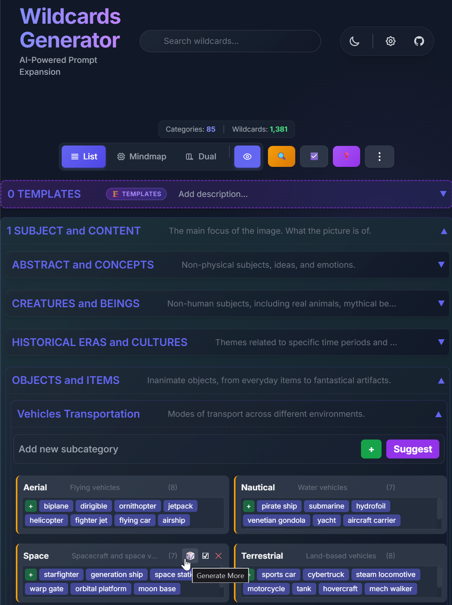

# Wildcards Generator (AI-Powered)

A powerful, standalone **Single Page Application (SPA)** for organizing, managing, and generating dynamic "wildcards" for AI image generation prompts. Built with a modern **Glassmorphism UI**, smooth animations, and direct **LLM Integration**.



> **What are Wildcards?**
> Wildcards are dynamic lists of terms (e.g., `__colors__`, `__styles__`) used to randomize image prompts. This tool helps you organize thousands of terms into a clean hierarchy and uses AI to generate new ideas automatically.

## ✨ Key Features

- **🧠 AI-Powered Generation**: Connect to **OpenRouter**, **Google Gemini**, or any **OpenAI-compatible** API to generate new wildcards contextually.
- **📂 Hierarchical Organization**: unlimited nested folders and drag-and-drop management.
- **🗺️ Mindmap View**: Visualize and manage your collection as an interactive mindmap.
- **⚡ Batch Operations**: Generate, move, or delete items across multiple folders at once.
- **🎨 Hybrid Template Generation**: Semantic analysis engine identifies category roles (Subject, Location, etc.) to generate structured, natural prompts.
- **🔍 Smart Search & Deduplication**: Instantly find terms and cleanup duplicate entries with AI assistance.
- **📂 Stable Organization**: Every category has a persistent ID, ensuring your tags and metadata stay safe even when moving folders.
- **📱 Responsive & Fast**: Runs entirely in the browser with no build step required for basic usage. PWA-ready.

## 🚀 Quick Start

### 1. Run Locally
Since this app uses ES Modules, it must be served via a local web server (not opened directly as a file).

**Using Node (Recommended)**:
```bash
# Install dependencies
npm install

# Start development server
npm run dev

# Open http://localhost:3000
```

### 2. Configure AI Provider
To unlock AI generation features:
1. Click **Global Settings** (bottom-left or top toolbar).
2. Choose your provider:
   - **OpenRouter**: Best for access to hundreds of models (Claude, GPT-4, Llama 3).
   - **Google Gemini**: Great free tier and high speed.
   - **Custom / Local**: Connect to LM Studio or Ollama running locally.
3. Enter your API Key. (Keys are stored safely in your browser's session memory).

## 📖 Usage Guide

### Managing Wildcards
- **Create**: Use the `+` buttons to add categories (folders) or wildcard lists.
- **Edit**: **Double-click** any name to rename it.
- **Drag & Drop**: Move items anywhere in the hierarchy.

### Generating Content
- **Single List**: Click the **Generate** button on any wildcard card.
- **Contextual**: The AI sees the path (e.g., `Characters > Fantasy > Orcs`) and existing items to generate relevant additions.
- **Templates**: Create a folder named `0_TEMPLATES`. Lists created here allow you to select other categories as "sources" to generate complex combinatorial prompts.

### Views
- **List View**: Classic vertical hierarchy.
- **Mindmap View**: Visual node-based graph. Great for brainstorming structure.
- **Focus Mode**: Hides everything except the active category for distraction-free work.

## 📚 Documentation

- **[Features](docs/features.md)**: detailed breakdown of all capabilities (v2.0+).
- **[Architecture](docs/architecture.md)**: how the code is structured (Vanilla JS + Proxies).
- **[Testing](tests/testing.md)**: running the Playwright test suite.
- **[API Reference](docs/openrouter_API_docs.md)**: OpenRouter integration details.

## 🤝 Contributing

Contributions are welcome! converting to a framework is NOT a goal; we aim to keep this vanilla and lightweight.
See **[CONTRIBUTING.md](CONTRIBUTING.md)** for guidelines.

## 🤖 For AI Agents

See **[AGENTS.md](AGENTS.md)** for strict architectural rules and workflow instructions.
